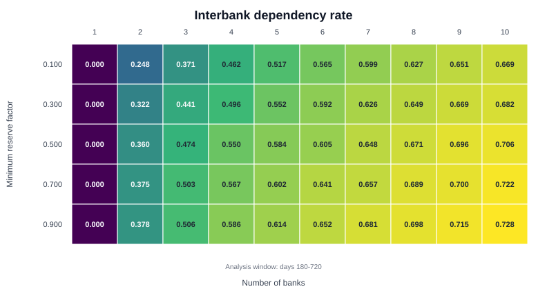
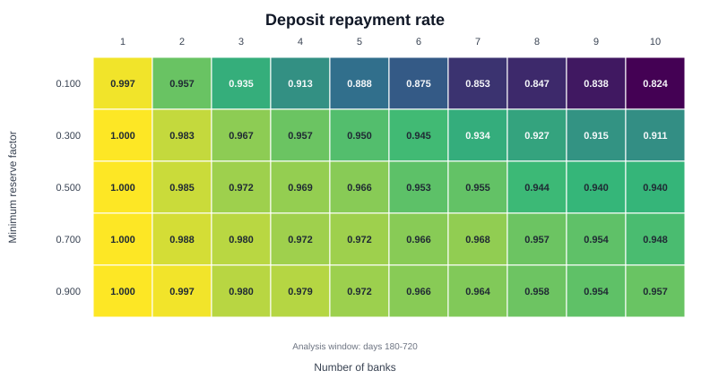
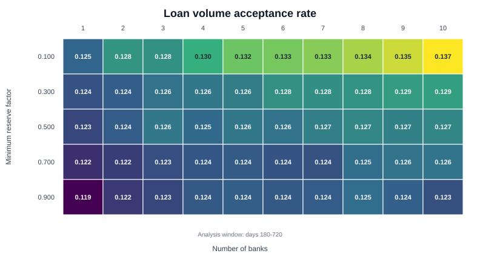
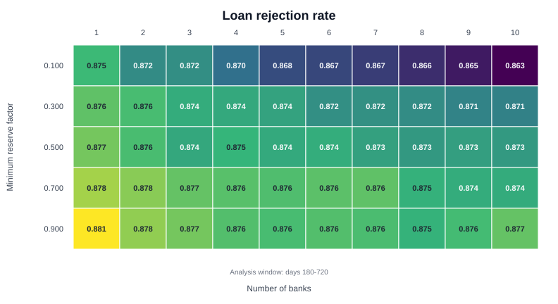
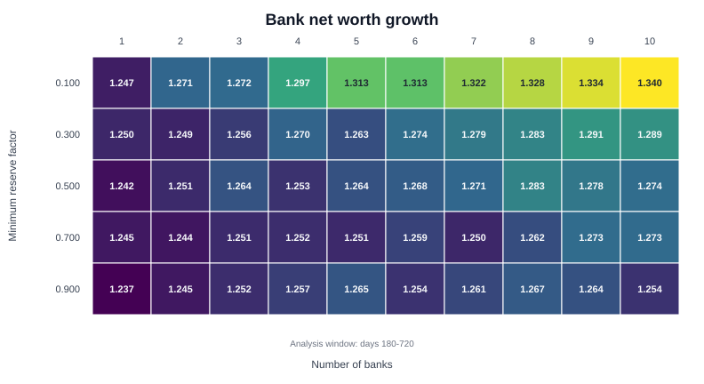
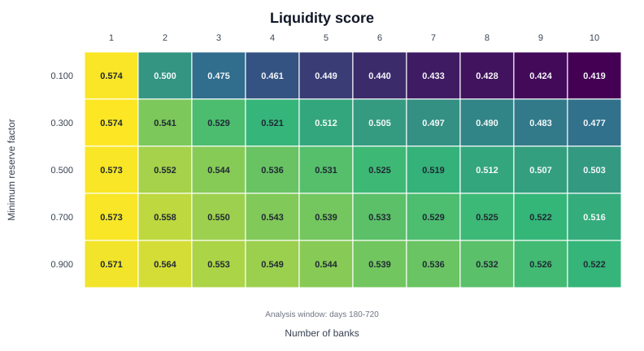

# Decentralization Efficiency Experiment

This experiment compares banking systems with the same total initial reserve base split across different numbers of banks.

Each run uses the same stochastic stream of client loan and deposit requests. The experiment varies:

- `NUM_BANKS`: number of banks receiving the reserve base,
- `MIN_RESERVES_FACTOR`: required reserve buffer as a fraction of liabilities.

The output is a set of heatmaps over `NUM_BANKS` and `MIN_RESERVES_FACTOR`.

## Setup

Current experiment configuration:

| Parameter | Value |
| --- | ---: |
| Replications | 8 |
| Number of banks | 1 to 10 |
| Reserve factors | 0.1, 0.3, 0.5, 0.7, 0.9 |
| Total initial reserves | 300M |
| Simulation duration | 720 days |
| Analysis window | days 180-720 |
| Client loan requests | Poisson, 25/day |
| Client deposit requests | Poisson, 5/day |
| Client loan terms | 90, 180, 360 days |
| Client deposit terms | 30, 90 days |
| Interbank loan term | 1 day |

The same total reserve amount is split evenly across banks. For example, with 1 bank the bank starts with 300M; with 10 banks each bank starts with 30M.

## Metrics

| Metric | Meaning |
| --- | --- |
| `loan_volume_acceptance_rate` | Granted client loan principal divided by requested client loan principal |
| `deposit_volume_repay_rate` | Repaid matured deposit value divided by all matured deposit value |
| `interbank_dependency_rate` | Granted interbank loans divided by granted client loans |
| `liquidity_stress_volume_rate` | Rejected client loan principal divided by requested client loan principal |
| `bank_net_growth_ratio` | Bank net worth at analysis end divided by bank net worth at analysis start |
| `liquidity_score` | Composite score built from loan acceptance, deposit repayment, interbank repayment, loan rejection, and bank net worth growth |

`liquidity_stress_volume_rate` is displayed as **Loan rejection rate** in the plots, because it measures total rejected loan volume.

## Output Files

```text
results/decentralization_efficiency/
├── metrics.csv
├── runs.csv
├── summary.csv
└── plots/
```

`metrics.csv` has one row per run. `summary.csv` averages metrics by `NUM_BANKS` and `MIN_RESERVES_FACTOR`. `runs.csv` stores seeds and parameter values.

## Results

### Interbank Dependency Rate



The first column is zero because a one-bank system has no interbank market. For systems with more banks, interbank dependency rises as the number of banks increases. The highest values appear in the upper-right region of the matrix, where the reserve base is split across many banks.

### Deposit Repayment Rate



Deposit repayment is highest in the one-bank case. With more banks, repayment rates decline. The decline is strongest at the lowest reserve factor and weaker at higher reserve factors.

### Loan Volume Acceptance Rate



Loan volume acceptance stays in a narrow range across the grid. It is slightly higher for more banks at low reserve factors and lower for higher reserve factors.

### Loan Rejection Rate



Loan rejection rate is the rejected share of requested client loan principal. It is high across the grid and changes moderately with the number of banks and reserve factor.

### Bank Net Worth Growth



Bank net worth grows in all cells of the matrix. Growth is higher in the low reserve-factor row and increases with the number of banks in that row. Higher reserve factors show smaller differences across the number of banks.

### Liquidity Score



The composite liquidity score is highest in the one-bank column. For multiple banks, the score is lower at low reserve factors and higher at larger reserve factors.

## Reproduce

From the repository root:

```bash
julia --project=. experiments/decentralization_efficiency/run.jl
julia --project=. experiments/decentralization_efficiency/plot.jl results/decentralization_efficiency
```

The generated heatmaps include the analysis window below each matrix.
