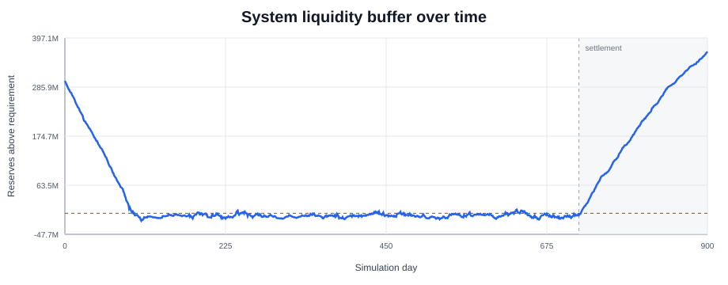
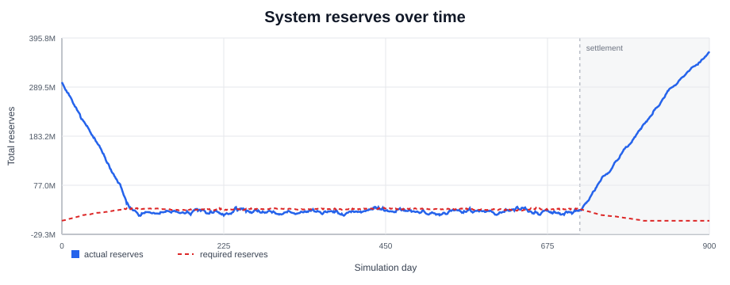
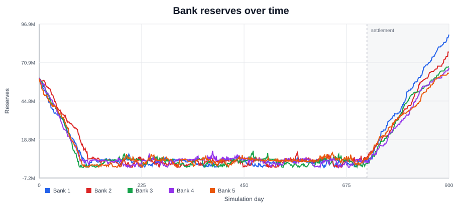
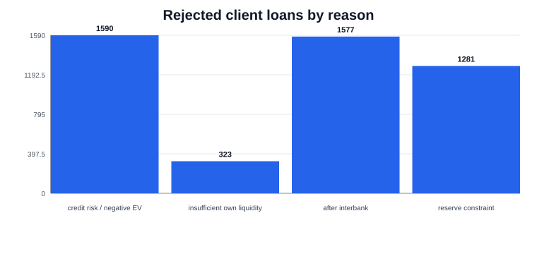
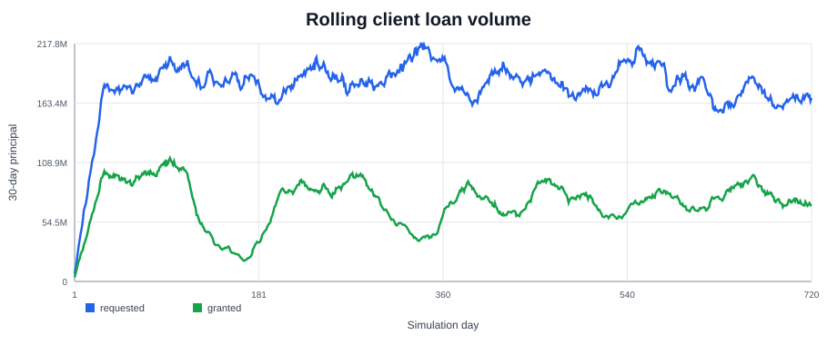
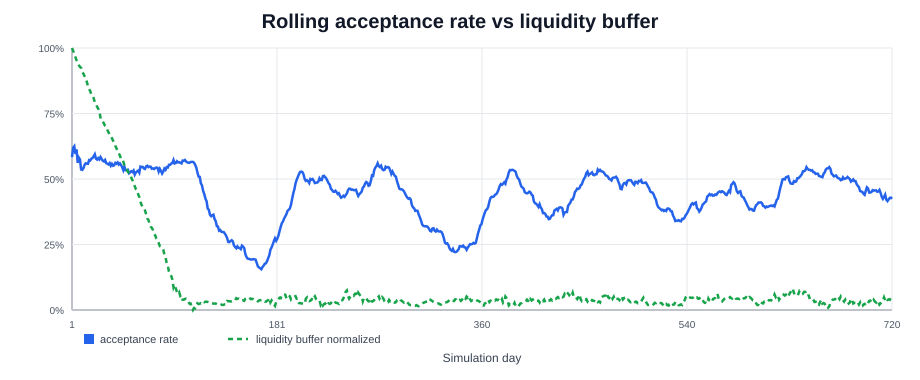
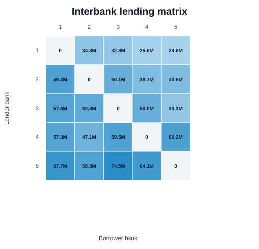
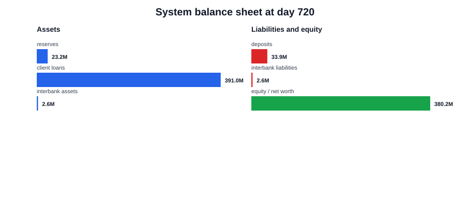

# Zero-Intelligence Banking System Demo

This demo runs a minimal agent-based banking system under liquidity stress.

Banks receive random client deposits and client loan requests. A bank grants a client loan when the loan has positive expected value under default risk and can be funded while satisfying the bank's reserve constraint. If the bank lacks liquidity, it can request funding from other banks through the interbank market.

The experiment shows how simple balance-sheet rules, random demand, credit-risk screening, and interbank funding create system-level liquidity dynamics.

## What To Look For

This run produces a constrained but functioning banking system:

- client credit demand is only partially satisfied,
- loan rejections come from both credit risk and liquidity constraints,
- the interbank market absorbs part of the liquidity mismatch,
- most client deposits are repaid,
- banks diverge despite identical initial reserve allocations.

## Configuration

| Parameter | Value |
| --- | ---: |
| Banks | 5 |
| Initial system reserves | 300M |
| Active demand horizon | 720 days |
| Settlement horizon | 900 days |
| Minimum reserve factor | 75% |
| Client loan requests | Poisson, 12/day |
| Client deposit requests | Poisson, 10/day |
| Client loan terms | 30, 90, 180 days |
| Client deposit terms | 30, 90 days |
| Interbank market | Enabled |
| Scenario seed | 10,001 |
| Run seed | 150,501 |

The 75% reserve factor is intentionally tight. It creates a visible liquidity constraint in a short demo run.

## Summary Results

| Metric | Value |
| --- | ---: |
| Client loan requests | 8,435 |
| Granted client loans | 3,664 |
| Rejected client loans | 4,771 |
| Requested client loan volume | 4.40B |
| Granted client loan volume | 1.77B |
| Rejected client loan volume | 2.62B |
| Loan acceptance rate | 43.4% |
| Loan volume acceptance rate | 40.3% |
| Interbank loans granted | 2,051 |
| Interbank loan volume | 988.5M |
| Interbank repayment rate | 90.6% |
| Deposit repayment rate | 99.55% |
| Defaulted deposit amount | 2.12M |
| Bank net worth growth | 1.22x |

## Main Result

The model enters a stress-without-collapse regime.

Loan supply is constrained, but the system continues operating. Banks reject many loans, use the interbank market heavily, repay almost all deposits, and finish with higher aggregate net worth. The run shows a clear trade-off between credit expansion, liquidity pressure, and interbank dependency.

## Plots

### System Liquidity Buffer



The liquidity buffer falls during the active demand phase and recovers during settlement. This is the main system-level stress indicator.

### System Reserves



System reserves decline as loans are granted and recover as obligations mature.

### Bank Reserves



Banks start from identical reserve allocations, then diverge as random client flows and interbank lending change their balance sheets.

### Rejected Client Loans By Reason



Rejected loans are split between credit-risk screening and liquidity constraints. This makes the lending decision visible instead of reducing it to a single acceptance rate.

### Rolling Loan Volume



The rolling 30-day volume shows how much requested credit the system can actually supply during the active demand window.

### Acceptance Rate And Liquidity Buffer



The acceptance rate is shaped by both credit risk and available liquidity. The liquidity buffer gives context for periods of tighter lending.

### Interbank Lending Matrix



Rows are lending banks and columns are borrowing banks. The matrix shows which banks become liquidity providers and which banks rely on interbank funding.

### System Balance Sheet



The balance sheet snapshot aggregates reserves, outstanding loans, deposits, interbank exposures, and net worth.

## Reproduce

From the repository root:

```bash
julia --project=. experiments/demo/run.jl
```

Outputs are written to:

```text
results/demo/events.csv
results/demo/bank_states.csv
results/demo/metrics.csv
results/demo/plots/index.html
```

The generated `events.csv` is the canonical simulation output. The plots and metrics are derived from that event log and the recorded bank-state snapshots.
